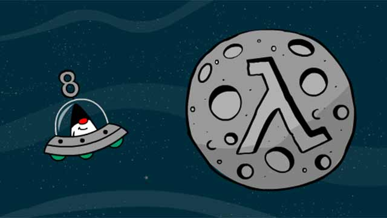

# Java 8新特性：lambda表达式



Java 8终于引进了lambda表达式，这标志着Java往函数式编程又迈进了一小步。

在Java 8以前的代码中，为了实现带一个方法的接口，往往需要定义一个匿名类并复写接口方法，代码显得很臃肿。比如常见的`Comparator`接口：

```java
String[] oldWay = "Improving code with Lambda expressions in Java 8".split(" ");
Arrays.sort(oldWay, new Comparator<String>() {
    @Override
    public int compare(String s1, String s2) {
        // 忽略大小写排序:
        return s1.toLowerCase().compareTo(s2.toLowerCase());
    }
});
System.out.println(String.join(", ", oldWay));
```

对于只有一个方法的接口，在Java 8中，现在可以把它视为一个函数，用lambda表示式简化如下：

```java
String[] newWay = "Improving code with Lambda expressions in Java 8".split(" ");
Arrays.sort(newWay, (s1, s2) -> {
    return s1.toLowerCase().compareTo(s2.toLowerCase());
});
System.out.println(String.join(", ", newWay));
```

Java 8没有引入新的关键字lambda，而是用`()->{}`这个奇怪的符号表示lambda函数。函数类型不需要申明，可以由接口的方法签名自动推导出来，对于上面的lambda函数：

```java
(s1, s2) -> {
    return s1.toLowerCase().compareTo(s2.toLowerCase());
});
```

参数由`Comparator<String>`自动推导出`String`类型，返回值也必须符合接口的方法签名。

实际上，lambda表达式最终也被编译为一个实现类，不过语法上做了简化。

对于Java自带的标准库里的大量单一方法接口，很多都已经标记为`@FunctionalInterface`，表明该接口可以作为函数使用。

以`Runnable`接口为例，很多时候干活的代码还没有定义class的代码多，现在可以用lambda实现：

```java
public static void main(String[] args) {
    // old way:
    Runnable oldRunnable = new Runnable() {
        @Override
        public void run() {
            System.out.println(Thread.currentThread().getName() + ": Old Runnable");
        }
    };
    Runnable newRunnable = () -> {
        System.out.println(Thread.currentThread().getName() + ": New Lambda Runnable");
    };
    new Thread(oldRunnable).start();
    new Thread(newRunnable).start();
}
```

在未来的Java代码中，会出现越来越多的`()->{}`表达式。
