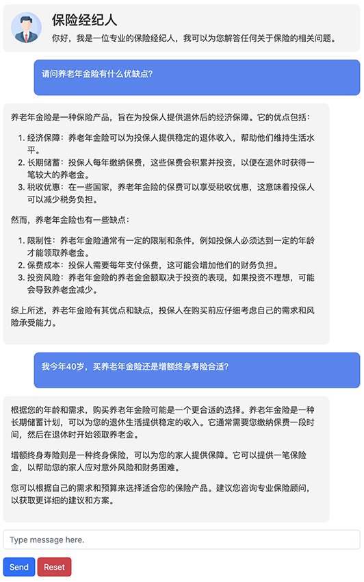

# 设计AI驱动的搜索引擎：用Postgres实现Embedding

在[设计AI驱动的搜索引擎：基于语义的问答系统](../2023-08-01-ai-search-engine-by-embeddings/index.html)一文中，我们用Redisearch实现了Vector的搜索，本质上就是基于Embedding实现了基于文档的AI问答索引。

但是绝大多数系统，文档之类的数据都是存在SQL数据库里的，如果我们引入Redis，则需要维护另一个系统，有很多同步更新的功能都要自己开发，并且，Redis的管理工具远没有SQL数据库那么多，查看Redisearch的索引基本上是黑盒，不便于运维。

如果SQL数据库能支持Vector，那么我们就不需要用Redis搞这么麻烦，一个SQL就能搞定：

```sql
SELECT doc_id, doc_content FROM docs WHERE doc_vector LIKE text2vec(?) ORDER BY doc_vector LIMIT ?
```

结果我发现有一个[pgvector](https://github.com/pgvector/pgvector)已经以插件的形式为Postgres数据库提供了Vector存储和搜索的功能。

今天我们就用Postgres配合pgvector插件实现SQL数据库的向量搜索。

### 1. 搭建Postgres环境

首先，我们需要一个集成了pgvector插件的Postgres数据库。虽然可以自己编译，但最简单的方式还是用Docker跑[pgvector](https://hub.docker.com/r/ankane/pgvector)镜像。

pgvector镜像配置和Postgres一致，我们需要以下几个参数：

- 映射数据库端口：`-p 5432:5432`；
- 设置数据库口令：`-e POSTGRES_PASSWORD=password`；
- 指定数据库存储路径：`-e PGDATA=/var/lib/postgresql/data/pgdata`；
- 挂载外部存储：`-v /path/to/llm-embedding-sample/pg-data:/var/lib/postgresql/data`；
- 挂载一个包含初始化文件的目录：`-v /path/to/llm-embedding-sample/pg-init-script:/docker-entrypoint-initdb.d`。

用如下命令启动数据库：

```plain
$ docker run -d \
       --rm \
       --name pgvector \
       -p 5432:5432 \
       -e POSTGRES_PASSWORD=password \
       -e POSTGRES_USER=postgres \
       -e POSTGRES_DB=postgres \
       -e PGDATA=/var/lib/postgresql/data/pgdata \
       -v /path/to/llm-embedding-sample/pg-data:/var/lib/postgresql/data \
       -v /path/to/llm-embedding-sample/pg-init-script:/docker-entrypoint-initdb.d \
       ankane/pgvector:latest
```

注意把`/path/to/`替换成真实路径。

### 2. 编写初始化脚本

初始化脚本是一个SQL文件，内容如下：

```sql
-- 使用vector扩展:
CREATE EXTENSION vector;

-- 创建表:
CREATE TABLE IF NOT EXISTS docs (
    id bigserial NOT NULL PRIMARY KEY,
    name varchar(100) NOT NULL,
    content text NOT NULL,
    embedding vector(1536) NOT NULL -- NOTE: 1536 for ChatGPT
);

-- 创建索引:
CREATE INDEX ON docs USING ivfflat (embedding vector_cosine_ops);
```

初始化脚本仅执行一次，我们在脚本中创建一个`docs`表，其中`embedding`列数据格式为`vector(1536)`（根据LLM模型输出的Embedding向量大小设定），这样我们就得到了一个能同时存储文档内容和向量的表。

### 3. 初始化docs

在Flask App启动时，我们把存储在`/docs`目录下的所有`.md`文件内容读出来，生成向量，然后存储到`docs`表中：

```python
def create_embedding(s: str) -> np.array:
    resp = openai.Embedding.create(input=s, model='text-embedding-ada-002')
    return np.array(resp['data'][0]['embedding'])

def load_docs():
    pwd = os.path.split(os.path.abspath(__file__))[0]
    docs = os.path.join(pwd, 'docs')
    print(f'set doc dir: {docs}')
    for file in os.listdir(docs):
        if not file.endswith('.md'):
            continue
        name = file[:-3]
        if db_exist_by_name(name):
            print(f'doc already exist.')
            continue
        print(f'load doc {name}...')
        with open(os.path.join(docs, file), 'r', encoding='utf-8') as f:
            content = f.read()
            print(f'create embedding for {name}...')
            embedding = create_embedding(content)
            doc = dict(name=name, content=content,
                       embedding=embedding)
            db_insert(doc)
            print(f'doc {name} created.')
```

这样我们就把文档内容和向量存储到一张表中了。

### 4. 查询

现在，我们直接用SQL查询就可以实现向量搜索，语法如下：

```sql
SELECT
    id, name, content, -- 正常列
    embedding <=> %s AS distance -- 相似度距离
FROM docs
ORDER BY embedding <=> %s -- 按相似度排序
LIMIT 3
```

其中，`embedding <=> %s`是pgvector按余弦距离查询的语法，值越小表示相似度越高，取相似度最高的3个文档。

用Python配合[psycopg2](https://www.psycopg.org/)查询代码如下：

```python
def db_select_by_embedding(embedding: np.array):
    sql = 'SELECT id, name, content, embedding <=> %s AS distance FROM docs ORDER BY embedding <=> %s LIMIT 3'
    with db_conn() as conn:
        cursor = conn.cursor(cursor_factory=RealDictCursor)
        values = (embedding, embedding)
        cursor.execute(sql, values)
        results = cursor.fetchall()
        cursor.close()
        return results
```

因为SQL查询非常简单，如果我们要实现其他过滤功能，比如按用户过滤文档，加上`WHERE`条件就可以了：

```sql
SELECT
    id, name, content, -- 正常列
    embedding <=> %s AS distance -- 相似度距离
FROM docs
WHERE userId = %s
ORDER BY embedding <=> %s -- 按相似度排序
LIMIT 3
```

我们放入几个保险产品的文档进去，最终实现Flask App效果如下：



### 源码

本文所有源码均可通过[GitHub](https://github.com/michaelliao/llm-embedding-sample)下载：

<a class="git-explorer" href="https://github.com/michaelliao/llm-embedding-sample/tree/master">GitHub</a>

### 参考

- [Github:pgvector/pgvector](https://github.com/pgvector/pgvector)
- [Storing OpenAI embeddings in Postgres with pgvector](https://supabase.com/blog/openai-embeddings-postgres-vector)
- [DockerHub: Postgres](https://hub.docker.com/_/postgres)
