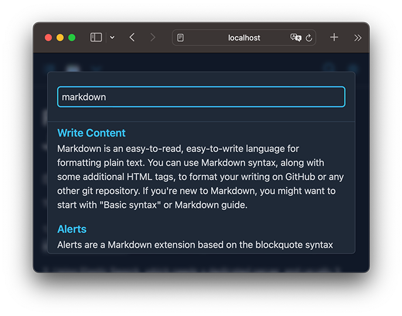

# 纯JavaScript实现全文搜索

要给网站加上全文搜索，有几种方式：

直接用站内搜索，比如用Google搜索`xyz site:example.com`，缺点是实时性太差；

用Elastic Search，需要独立的服务器，如果是云托管，3台起步，非常贵；

用Redisearch，需要Redis服务器+插件，以及额外的开发量。

对于中小网站，需要索引的页面数量不多，完全可以采用纯前端构建索引，在页面实时搜索。

GitSite使用FlexSearch这个JavaScript编写的搜索引擎实现前端搜索：



使用FlexSearch比较简单，但是默认不支持中文，官网给出了一个针对CJK的分词算法：

```javascript
var index = FlexSearch.create({
    encode: str => str.replace(/[\x00-\x7F]/g, "").split("")
});
```

可以用，但用了以后英文又没法搜了，因为它只认CJK的字符，其他的包括英文在内全部丢掉了。

所以我们需要写一个稍微全面一点的分词算法，既能支持英文，也能支持中文。

在JavaScript中，一个字符对应一个Unicode编码，参考Unicode编码。[^unicode]

[^unicode]: [Unicode Character Ranges](https://jrgraphix.net/r/Unicode/)

我们可以把字符分为两大类：

一类是英文、法文、德文等字母，依靠空格分隔单词，我们把Unicode的编码范围列出来，用`isAlphabet()`识别：

```javascript
const ALPHABETS = [
    [0x30, 0x39], // 0-9
    [0x41, 0x5a], // A-Z
    [0x61, 0x7a], // a-z
    [0xc0, 0x2af], // part of Latin-1 supplement / Latin extended A/B / IPA
    [0x370, 0x52f], // Greek / Cyrillic / Cyrillic supplement
];

function isAlphabet(n) {
    for (let range of ALPHABETS) {
        if (n >= range[0] && n <= range[1]) {
            return true;
        }
    }
    return false;
}
```

一类是中文、日文等文字，一个字符对应一个字，我们也把Unicode的编码范围列出来，用`isSingleChar()`识别：

```javascript
const SINGLE_CHARS = [
    [0xe00, 0x0e5b], // Thai
    [0x3040, 0x309f], // Hiragana
    [0x4e00, 0x9fff], // CJK
    [0xac00, 0xd7af], // Hangul syllables
];

function isSingleChar(n) {
    for (let range of SINGLE_CHARS) {
        if (n >= range[0] && n <= range[1]) {
            return true;
        }
    }
    return false;
}
```

现在，我们就可以实现一个用于分词的函数：

```javascript
function tokenizer(str) {
    const length = str.length;
    const tokens = [];
    let last = '';
    for (let i = 0; i < length; i++) {
        let code = str.charCodeAt(i);
        if (isSingleChar(code)) {
            if (last) {
                if (last.length > 1) {
                    tokens.push(last.toLowerCase());
                }
                last = '';
            }
            tokens.push(str[i]);
        } else if (isAlphabet(code)) {
            last = last + str[i];
        } else {
            if (last) {
                if (last.length > 1) {
                    tokens.push(last.toLowerCase());
                }
                last = '';
            }
        }
    }
    if (last) {
        if (last.length > 1) {
            tokens.push(last.toLowerCase());
        }
        last = '';
    }
    return tokens;
}
```

使用Flexsearch时，指定我们自己的`tokenizer()`函数：

```javascript
const index = new Index({
    encode: tokenizer
});
```

直接实现英文、法文、德文、俄文、中文、日文、韩文搜索。

## 缺点

上述分词算法可以说简单直接，但缺点还是有的：

- 每个字就是一个词，没有实现中文分词，因为我们没有词库，而且要得到好的效果，词库还需要定期更新；
- 没有实现英文单词的词态转换，原因还是没有词库；
- 没有实现英文和中文的停用词（Stop Words），原因仍然是没有词库。

不过，考虑到几行代码就实现了比较完善的前端搜索，这个性价比已经很高了，收工！
