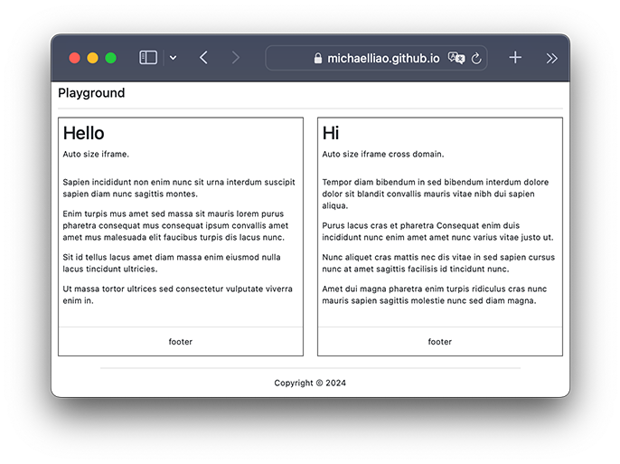

# 自适应iframe高度

使用`iframe`嵌入页面很方便，但必须在父页面指定`iframe`的高度。如果`iframe`页面内容的高度超过了指定高度，会出现滚动条，很难看。

如何让`iframe`自适应自身高度，让整个页面看起来像一个整体？

在HTML5之前，有很多使用JavaScript的Hack技巧，代码量大，而且很难通用。随着现代浏览器引入了新的ResizeObserver API[^ResizeObserver]，解决`iframe`高度问题就变得简单了。

[^ResizeObserver]: [ResizeObserver](https://developer.mozilla.org/en-US/docs/Web/API/ResizeObserver)接口监视Element或者SVGElement尺寸的变化。

我们假设父页面是`index.html`，要嵌入到`iframe`的子页面是`target.html`，在父页面中，先向页面添加一个`iframe`：

```javascript
const iframe1 = document.createElement('iframe');
iframe1.src = 'target.html';
iframe1.onload = autoResize;
document.getElementById('sameDomain').appendChild(iframe1);
```

当`iframe`载入完成后，触发`onload`事件，然后自动调用`autoResize()`函数：

```javascript
function autoResize(event) {
    // 获取iframe元素:
    const iframeEle = event.target;
    // 创建一个ResizeObserver:
    const resizeRo = new ResizeObserver((entries) => {
        let entry = entries[0];
        let height = entry.contentRect.height;
        iframeEle.style.height = height + 'px';
    });
    // 开始监控iframe的body元素:
    resizeRo.observe(iframeEle.contentWindow.document.body);
}
```

通过创建`ResizeObserver`，我们就可以在`iframe`的`body`元素大小更改时获得回调，在回调函数中对`iframe`设置一个新的高度，就完成了`iframe`的自适应高度。

### 跨域问题

`ResizeObserver`很好地解决了`iframe`的监控，但是，当我们引入跨域的`iframe`时，上述代码就失效了，原因是浏览器阻止了跨域获取`iframe`的`body`元素。

要解决跨域的`iframe`自适应高度问题，我们需要使用`postMessage`机制，让`iframe`页面向父页面主动报告自身高度。

假定父页面仍然是`index.html`，要嵌入到`iframe`的子页面是`http://xyz/cross.html`，在父页面中，先向页面添加一个跨域的`iframe`：

```javascript
const iframe2 = document.createElement('iframe');
iframe2.src = 'http://xyz/cross.html';
iframe2.onload = autoResize;
document.getElementById('crossDomain').appendChild(iframe2);
```

在`cross.html`页面中，如何获取自身高度？

我们需要现代浏览器引入的一个新的MutationObserver API[^MutationObserver]，它允许监控任意DOM树的修改。

[^MutationObserver]: [MutationObserver](https://developer.mozilla.org/en-US/docs/Web/API/MutationObserver)接口提供了对DOM树更改的监视能力。

在`cross.html`页面中，使用以下代码监控`body`元素的修改（包括子元素）：

```javascript
// 创建MutationObserver:
const domMo = new MutationObserver(() => {
    // 获取body的高度:
    let currentHeight = body.scrollHeight;
    // 向父页面发消息:
    parent.postMessage({
        type: 'resize',
        height: currentHeight
    }, '*');
});
// 开始监控body元素的修改:
domMo.observe(body, {
    attributes: true,
    childList: true,
    subtree: true
});
```

当`iframe`页面的`body`有变化时，回调函数通过`postMessage`向父页面发送消息，消息内容是自定义的。在父页面中，我们给`window`添加一个`message`事件监听器，即可收取来自`iframe`页面的消息，然后自动更新`iframe`高度：

```javascript
window.addEventListener('message', function (event) {
    let eventData = event.data;
    if (eventData && eventData.type === 'resize') {
        iframeEle.style.height = eventData.height + 'px';
    }
}, false);
```

使用现代浏览器提供的`ResizeObserver`和`MutationObserver` API，我们就能轻松实现`iframe`的自适应高度。

点击查看[演示页面](https://michaelliao.github.io/auto-resize-iframe/)：


