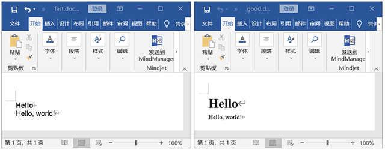

# 抽象工厂

> 提供一个创建一系列相关或相互依赖对象的接口，而无需指定它们具体的类。

抽象工厂模式（Abstract Factory）是一个比较复杂的创建型模式。

抽象工厂模式和工厂方法不太一样，它要解决的问题比较复杂，不但工厂是抽象的，产品是抽象的，而且有多个产品需要创建，因此，这个抽象工厂会对应到多个实际工厂，每个实际工厂负责创建多个实际产品：

```ascii
                                ┌────────┐
                             ─ ▶│ProductA│
┌────────┐    ┌─────────┐   │   └────────┘
│ Client │─ ─▶│ Factory │─ ─
└────────┘    └─────────┘   │   ┌────────┐
                   ▲         ─ ▶│ProductB│
           ┌───────┴───────┐    └────────┘
           │               │
      ┌─────────┐     ┌─────────┐
      │Factory1 │     │Factory2 │
      └─────────┘     └─────────┘
           │   ┌─────────┐ │   ┌─────────┐
            ─ ▶│ProductA1│  ─ ▶│ProductA2│
           │   └─────────┘ │   └─────────┘
               ┌─────────┐     ┌─────────┐
           └ ─▶│ProductB1│ └ ─▶│ProductB2│
               └─────────┘     └─────────┘
```

这种模式有点类似于多个供应商负责提供一系列类型的产品。我们举个例子：

假设我们希望为用户提供一个[Markdown](https://baike.baidu.com/item/MarkDown)文本转换为HTML和Word的服务，它的接口定义如下：

```java
public interface AbstractFactory {
    // 创建Html文档:
    HtmlDocument createHtml(String md);
    // 创建Word文档:
    WordDocument createWord(String md);
}
```

注意到上面的抽象工厂仅仅是一个接口，没有任何代码。同样的，因为`HtmlDocument`和`WordDocument`都比较复杂，现在我们并不知道如何实现它们，所以只有接口：

```java
// Html文档接口:
public interface HtmlDocument {
    String toHtml();
    void save(Path path) throws IOException;
}

// Word文档接口:
public interface WordDocument {
    void save(Path path) throws IOException;
}
```

这样，我们就定义好了抽象工厂（`AbstractFactory`）以及两个抽象产品（`HtmlDocument`和`WordDocument`）。因为实现它们比较困难，我们决定让供应商来完成。

现在市场上有两家供应商：FastDoc Soft的产品便宜，并且转换速度快，而GoodDoc Soft的产品贵，但转换效果好。我们决定同时使用这两家供应商的产品，以便给免费用户和付费用户提供不同的服务。

我们先看看FastDoc Soft的产品是如何实现的。首先，FastDoc Soft必须要有实际的产品，即`FastHtmlDocument`和`FastWordDocument`：

```java
public class FastHtmlDocument implements HtmlDocument {
    public String toHtml() {
        ...
    }
    public void save(Path path) throws IOException {
        ...
    }
}

public class FastWordDocument implements WordDocument {
    public void save(Path path) throws IOException {
        ...
    }
}
```

然后，FastDoc Soft必须提供一个实际的工厂来生产这两种产品，即`FastFactory`：

```java
public class FastFactory implements AbstractFactory {
    public HtmlDocument createHtml(String md) {
        return new FastHtmlDocument(md);
    }
    public WordDocument createWord(String md) {
        return new FastWordDocument(md);
    }
}
```

这样，我们就可以使用FastDoc Soft的服务了。客户端编写代码如下：

```java
// 创建AbstractFactory，实际类型是FastFactory:
AbstractFactory factory = new FastFactory();
// 生成Html文档:
HtmlDocument html = factory.createHtml("#Hello\nHello, world!");
html.save(Paths.get(".", "fast.html"));
// 生成Word文档:
WordDocument word = factory.createWord("#Hello\nHello, world!");
word.save(Paths.get(".", "fast.doc"));
```

如果我们要同时使用GoodDoc Soft的服务怎么办？因为用了抽象工厂模式，GoodDoc Soft只需要根据我们定义的抽象工厂和抽象产品接口，实现自己的实际工厂和实际产品即可：

```java
// 实际工厂:
public class GoodFactory implements AbstractFactory {
    public HtmlDocument createHtml(String md) {
        return new GoodHtmlDocument(md);
    }
    public WordDocument createWord(String md) {
        return new GoodWordDocument(md);
    }
}

// 实际产品:
public class GoodHtmlDocument implements HtmlDocument {
    ...
}

public class GoodWordDocument implements HtmlDocument {
    ...
}
```

客户端要使用GoodDoc Soft的服务，只需要把原来的`new FastFactory()`切换为`new GoodFactory()`即可。

注意到客户端代码除了通过`new`创建了`FastFactory`或`GoodFactory`外，其余代码只引用了产品接口，并未引用任何实际产品（例如，`FastHtmlDocument`），如果把创建工厂的代码放到`AbstractFactory`中，就可以连实际工厂也屏蔽了：

```java
public interface AbstractFactory {
    public static AbstractFactory createFactory(String name) {
        if (name.equalsIgnoreCase("fast")) {
            return new FastFactory();
        } else if (name.equalsIgnoreCase("good")) {
            return new GoodFactory();
        } else {
            throw new IllegalArgumentException("Invalid factory name");
        }
    }
}
```

我们来看看`FastFactory`和`GoodFactory`创建的`WordDocument`的实际效果：



注意：出于简化代码的目的，我们只支持两种Markdown语法：以`#`开头的标题以及普通正文。

### 练习

使用Abstract Factory模式实现`HtmlDocument`和`WordDocument`。

[下载练习](pattern-abstract-factory.zip)

### 小结

抽象工厂模式是为了让创建工厂和一组产品与使用相分离，并可以随时切换到另一个工厂以及另一组产品；

抽象工厂模式实现的关键点是定义工厂接口和产品接口，但如何实现工厂与产品本身需要留给具体的子类实现，客户端只和抽象工厂与抽象产品打交道。
