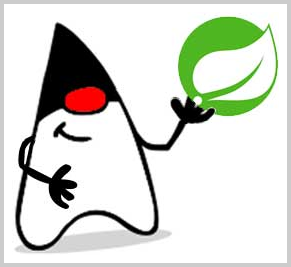

# Spring开发

什么是Spring？

Spring是一个支持快速开发Java EE应用程序的框架。它提供了一系列底层容器和基础设施，并可以和大量常用的开源框架无缝集成，可以说是开发Java EE应用程序的必备。

Spring最早是由Rod Johnson这哥们在他的《[Expert One-on-One J2EE Development without EJB](https://book.douban.com/subject/1426848/)》一书中提出的用来取代EJB的轻量级框架。随后这哥们又开始专心开发这个基础框架，并起名为Spring Framework。

随着Spring越来越受欢迎，在Spring Framework基础上，又诞生了Spring Boot、Spring Cloud、Spring Data、Spring Security等一系列基于Spring Framework的项目。本章我们只介绍Spring Framework，即最核心的Spring框架。后续章节我们还会涉及Spring Boot、Spring Cloud等其他框架。

### Spring Framework

Spring Framework主要包括几个模块：

- 支持IoC和AOP的容器；
- 支持JDBC和ORM的数据访问模块；
- 支持声明式事务的模块；
- 支持基于Servlet的MVC开发；
- 支持基于Reactive的Web开发；
- 以及集成JMS、JavaMail、JMX、缓存等其他模块。

我们会依次介绍Spring Framework的主要功能。

本教程使用的Spring版本是6.x版，如果使用Spring 5.x则需注意，两者有以下不同：

|              | Spring 5.x       | Spring 6.x         |
|--------------|------------------|--------------------|
| JDK版本      | >= 1.8           | >= 17              |
| Tomcat版本   | 9.x              | 10.x               |
| Annotation包 | javax.annotation | jakarta.annotation |
| Servlet包    | javax.servlet    | jakarta.servlet    |
| JMS包        | javax.jms        | jakarta.jms        |
| JavaMail包   | javax.mail       | jakarta.mail       |

如果使用Spring的其他版本，则需要根据需要调整代码。

Spring官网是[spring.io](https://spring.io/)，要注意官网有许多项目，我们这里说的Spring是指Spring Framework，可以直接从这里访问[最新版以及文档](https://spring.io/projects/spring-framework)，建议添加到浏览器收藏夹。
