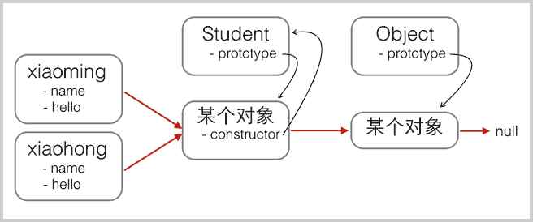

# 创建对象

JavaScript对每个创建的对象都会设置一个原型，指向它的原型对象。

当我们用`obj.xxx`访问一个对象的属性时，JavaScript引擎先在当前对象上查找该属性，如果没有找到，就到其原型对象上找，如果还没有找到，就一直上溯到`Object.prototype`对象，最后，如果还没有找到，就只能返回`undefined`。

例如，创建一个`Array`对象：

```javascript
let arr = [1, 2, 3];
```

其原型链是：

```ascii
       null
         ▲
         │
┌─────────────────┐
│Object.prototype │
└─────────────────┘
         ▲
         │
┌─────────────────┐
│ Array.prototype │
└─────────────────┘
         ▲
         │
┌─────────────────┐
│       arr       │
└─────────────────┘
```

`Array.prototype`定义了`indexOf()`、`shift()`等方法，因此你可以在所有的`Array`对象上直接调用这些方法。

当我们创建一个函数时：

```javascript
function foo() {
    return 0;
}
```

函数也是一个对象，它的原型链是：

```ascii
        null
          ▲
          │
┌───────────────────┐
│ Object.prototype  │
└───────────────────┘
          ▲
          │
┌───────────────────┐
│Function.prototype │
└───────────────────┘
          ▲
          │
┌───────────────────┐
│        foo        │
└───────────────────┘
```

由于`Function.prototype`定义了`apply()`等方法，因此，所有函数都可以调用`apply()`方法。

很容易想到，如果原型链很长，那么访问一个对象的属性就会因为花更多的时间查找而变得更慢，因此要注意不要把原型链搞得太长。

### 构造函数

除了直接用`{ ... }`创建一个对象外，JavaScript还可以用一种构造函数的方法来创建对象。它的用法是，先定义一个构造函数：

```javascript
function Student(name) {
    this.name = name;
    this.hello = function () {
        alert('Hello, ' + this.name + '!');
    }
}
```

你会问，咦，这不是一个普通函数吗？

这确实是一个普通函数，但是在JavaScript中，可以用关键字`new`来调用这个函数，并返回一个对象：

```javascript
let xiaoming = new Student('小明');
xiaoming.name; // '小明'
xiaoming.hello(); // Hello, 小明!
```

*注意*，如果不写`new`，这就是一个普通函数，它返回`undefined`。但是，如果写了`new`，它就变成了一个构造函数，它绑定的`this`指向新创建的对象，并默认返回`this`，也就是说，不需要在最后写`return this;`。

新创建的`xiaoming`的原型链是：

```ascii
       null
         ▲
         │
┌─────────────────┐
│Object.prototype │
└─────────────────┘
         ▲
         │
┌─────────────────┐
│Student.prototype│
└─────────────────┘
         ▲
         │
┌─────────────────┐
│    xiaoming     │
└─────────────────┘
```

也就是说，`xiaoming`的原型指向函数`Student`的原型。如果你又创建了`xiaohong`、`xiaojun`，那么这些对象的原型与`xiaoming`是一样的：

```ascii
              null
                ▲
                │
       ┌─────────────────┐
       │Object.prototype │
       └─────────────────┘
                ▲
                │
       ┌─────────────────┐
       │Student.prototype│
       └─────────────────┘
         ▲      ▲      ▲
         │      │      │
┌─────────┐┌─────────┐┌─────────┐
│xiaoming ││xiaohong ││ xiaojun │
└─────────┘└─────────┘└─────────┘
```

用`new Student()`创建的对象还从原型上获得了一个`constructor`属性，它指向函数`Student`本身：

```javascript
xiaoming.constructor === Student.prototype.constructor; // true
Student.prototype.constructor === Student; // true

Object.getPrototypeOf(xiaoming) === Student.prototype; // true

xiaoming instanceof Student; // true
```

看晕了吧？用一张图来表示这些乱七八糟的关系就是：



红色箭头是原型链。注意，`Student.prototype`指向的对象就是`xiaoming`、`xiaohong`的原型对象，这个原型对象自己还有个属性`constructor`，指向`Student`函数本身。

另外，函数`Student`恰好有个属性`prototype`指向`xiaoming`、`xiaohong`的原型对象，但是`xiaoming`、`xiaohong`这些对象可没有`prototype`这个属性，不过可以用`__proto__`这个非标准用法来查看。

现在我们就认为`xiaoming`、`xiaohong`这些对象“继承”自`Student`。

不过还有一个小问题，注意观察：

```javascript
xiaoming.name; // '小明'
xiaohong.name; // '小红'
xiaoming.hello; // function: Student.hello()
xiaohong.hello; // function: Student.hello()
xiaoming.hello === xiaohong.hello; // false
```

`xiaoming`和`xiaohong`各自的`name`不同，这是对的，否则我们无法区分谁是谁了。

`xiaoming`和`xiaohong`各自的`hello`是一个函数，但它们是两个不同的函数，虽然函数名称和代码都是相同的！

如果我们通过`new Student()`创建了很多对象，这些对象的`hello`函数实际上只需要共享同一个函数就可以了，这样可以节省很多内存。

要让创建的对象共享一个`hello`函数，根据对象的属性查找原则，我们只要把`hello`函数移动到`xiaoming`、`xiaohong`这些对象共同的原型上就可以了，也就是`Student.prototype`：


修改代码如下：

```javascript
function Student(name) {
    this.name = name;
}

Student.prototype.hello = function () {
    alert('Hello, ' + this.name + '!');
};
```

用`new`创建基于原型的JavaScript的对象就是这么简单！

### 忘记写new怎么办

如果一个函数被定义为用于创建对象的构造函数，但是调用时忘记了写`new`怎么办？

在strict模式下，`this.name = name`将报错，因为`this`绑定为`undefined`，在非strict模式下，`this.name = name`不报错，因为`this`绑定为`window`，于是无意间创建了全局变量`name`，并且返回`undefined`，这个结果更糟糕。

所以，调用构造函数千万不要忘记写`new`。为了区分普通函数和构造函数，按照约定，构造函数首字母应当大写，而普通函数首字母应当小写，这样，一些语法检查工具如[jslint](https://www.jslint.com/)将可以帮你检测到漏写的`new`。

最后，我们还可以编写一个`createStudent()`函数，在内部封装所有的`new`操作。一个常用的编程模式像这样：

```javascript
function Student(props) {
    this.name = props.name || '匿名'; // 默认值为'匿名'
    this.grade = props.grade || 1; // 默认值为1
}

Student.prototype.hello = function () {
    alert('Hello, ' + this.name + '!');
};

function createStudent(props) {
    return new Student(props || {})
}
```

这个`createStudent()`函数有几个巨大的优点：一是不需要`new`来调用，二是参数非常灵活，可以不传，也可以这么传：

```javascript
let xiaoming = createStudent({
    name: '小明'
});

xiaoming.grade; // 1
```

如果创建的对象有很多属性，我们只需要传递需要的某些属性，剩下的属性可以用默认值。由于参数是一个Object，我们无需记忆参数的顺序。如果恰好从`JSON`拿到了一个对象，就可以直接创建出`xiaoming`。

### 练习

请利用构造函数定义`Cat`，并让所有的Cat对象有一个`name`属性，并共享一个方法`say()`，返回字符串`'Hello, xxx!'`：

```x-javascript
function Cat(name) {
    // TODO:
}

// 测试:
let kitty = new Cat('Kitty');
let doraemon = new Cat('哆啦A梦');
if (kitty && kitty.name === 'Kitty'
    && kitty.say
    && typeof kitty.say === 'function'
    && kitty.say() === 'Hello, Kitty!'
    && kitty.say === doraemon.say
) {
    console.log('测试通过!');
} else {
    console.log('测试失败!');
}
```
