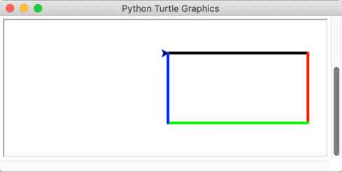
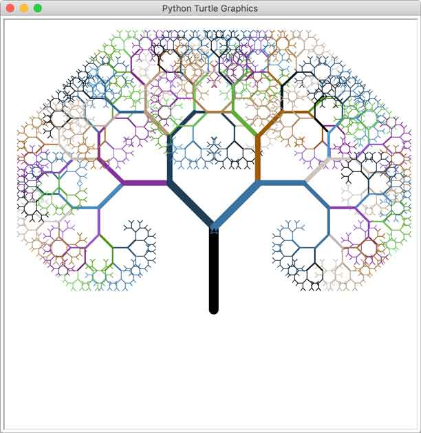

# 海龟绘图

在1966年，Seymour Papert和Wally Feurzig发明了一种专门给儿童学习编程的语言——[LOGO语言](https://baike.baidu.com/item/LOGO%E8%AF%AD%E8%A8%80/5881905)，它的特色就是通过编程指挥一个小海龟（turtle）在屏幕上绘图。

海龟绘图（Turtle Graphics）后来被移植到各种高级语言中，Python内置了`turtle`库，基本上100%复制了原始的Turtle Graphics的所有功能。

我们来看一个指挥小海龟绘制一个长方形的简单代码：

```python
# 导入turtle包的所有内容:
from turtle import *

# 设置笔刷宽度:
width(4)

# 前进:
forward(200)
# 右转90度:
right(90)

# 笔刷颜色:
pencolor('red')
forward(100)
right(90)

pencolor('green')
forward(200)
right(90)

pencolor('blue')
forward(100)
right(90)

# 调用done()使得窗口等待被关闭，否则将立刻关闭窗口:
done()
```

在命令行运行上述代码，会自动弹出一个绘图窗口，然后绘制出一个长方形：



从程序代码可以看出，海龟绘图就是指挥海龟前进、转向，海龟移动的轨迹就是绘制的线条。要绘制一个长方形，只需要让海龟前进、右转90度，反复4次。

调用`width()`函数可以设置笔刷宽度，调用`pencolor()`函数可以设置颜色。更多操作请参考[turtle库](https://docs.python.org/3.3/library/turtle.html#turtle-methods)的说明。

绘图完成后，记得调用`done()`函数，让窗口进入消息循环，等待被关闭。否则，由于Python进程会立刻结束，将导致窗口被立刻关闭。

`turtle`包本身只是一个绘图库，但是配合Python代码，就可以绘制各种复杂的图形。例如，通过循环绘制5个五角星：

```python
from turtle import *

def drawStar(x, y):
    pu()
    goto(x, y)
    pd()
    # set heading: 0
    seth(0)
    for i in range(5):
        fd(40)
        rt(144)

for x in range(0, 250, 50):
    drawStar(x, 0)

done()
```

程序执行效果如下：


使用递归，可以绘制出非常复杂的图形。例如，下面的代码可以绘制一棵分型树：

```python
from turtle import *

# 设置色彩模式是RGB:
colormode(255)

lt(90)

lv = 14
l = 120
s = 45

width(lv)

# 初始化RGB颜色:
r = 0
g = 0
b = 0
pencolor(r, g, b)

penup()
bk(l)
pendown()
fd(l)

def draw_tree(l, level):
    global r, g, b
    # save the current pen width
    w = width()

    # narrow the pen width
    width(w * 3.0 / 4.0)
    # set color:
    r = r + 1
    g = g + 2
    b = b + 3
    pencolor(r % 200, g % 200, b % 200)

    l = 3.0 / 4.0 * l

    lt(s)
    fd(l)

    if level < lv:
        draw_tree(l, level + 1)
    bk(l)
    rt(2 * s)
    fd(l)

    if level < lv:
        draw_tree(l, level + 1)
    bk(l)
    lt(s)

    # restore the previous pen width
    width(w)

speed("fastest")

draw_tree(l, 4)

done()
```

执行上述程序需要花费一定的时间，最后的效果如下：



### 参考源码

[rect.py](rect.py)

[starts.py](starts.py)

[tree.py](tree.py)
