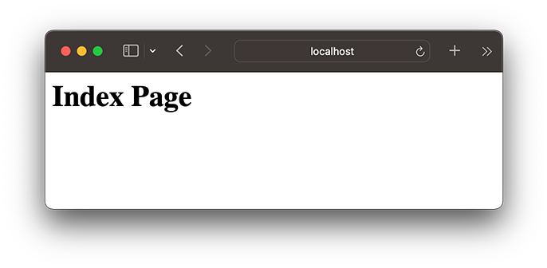

# 使用aiohttp

`asyncio`可以实现单线程并发IO操作。如果仅用在客户端，发挥的威力不大。如果把`asyncio`用在服务器端，例如Web服务器，由于HTTP连接就是IO操作，因此可以用单线程+`async`函数实现多用户的高并发支持。

`asyncio`实现了TCP、UDP、SSL等协议，`aiohttp`则是基于`asyncio`实现的HTTP框架。

我们先安装`aiohttp`：

```plain
$ pip install aiohttp
```

然后编写一个HTTP服务器，分别处理以下URL：

- `/` - 首页返回`Index Page`；
- `/{name}` - 根据URL参数返回文本`Hello, {name}!`。

代码如下：

```python
# app.py
from aiohttp import web

async def index(request):
    text = "<h1>Index Page</h1>"
    return web.Response(text=text, content_type="text/html")

async def hello(request):
    name = request.match_info.get("name", "World")
    text = f"<h1>Hello, {name}</h1>"
    return web.Response(text=text, content_type="text/html")

app = web.Application()

# 添加路由:
app.add_routes([web.get("/", index), web.get("/{name}", hello)])

if __name__ == "__main__":
    web.run_app(app)
```

直接运行`app.py`，访问首页：



访问`http://localhost:8080/Bob`：


使用aiohttp时，定义处理不同URL的`async`函数，然后通过`app.add_routes()`添加映射，最后通过`run_app()`以asyncio的机制启动整个处理流程。

### 参考源码

[app.py](app.py)
